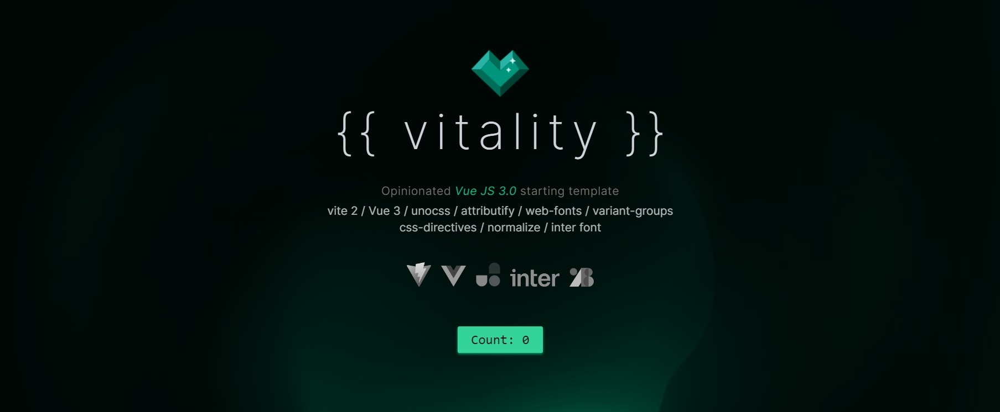

<h1 align="center">
Vitality
</h1>
<p align="center">
    Opinionated Vue 3 and Vite starter template.
</p>
<p align="center">
instantly kickstart your next idea
</p>


## Features

- ⚡️ [Vue 3](https://github.com/vuejs/vue-next), [Vite 2](https://github.com/vitejs/vite)

- 📦 [Components](./src/components)

- 🎨 [UnoCSS](https://github.com/antfu/unocss) - the instant on-demand atomic CSS engine
- ❤️ [Inter font](https://rsms.me/inter/) - Clean, beautiful and fast

- 🗒 [Markdown Support](https://github.com/antfu/vite-plugin-md)

- 🔥 Use the [new `<script setup>` syntax](https://github.com/vuejs/rfcs/pull/227)

- ☁️ Deploy on Netlify, zero-config

### Plugins

- [UnoCSS](https://github.com/vuejs/vue-router)
  - [`PresetUno`](https://github.com/unocss/unocss/tree/main/packages/preset-uno)  - The default preset
  - [`Attributify`](https://github.com/hannoeru/vite-plugin-pages) - Provides [Attributify Mode](https://github.com/unocss/unocss/tree/main/packages/preset-attributify#attributify-mode) to other presets and rules.
  - [`Webfonts`](https://github.com/unocss/unocss/tree/main/packages/preset-web-fonts) - Easy implementation of Google webfonts

### Resets

- [`Preflights`](https://v1.tailwindcss.com/docs/preflight) from tailwind
- [`reset.css`](https://meyerweb.com/eric/tools/css/reset/index.html) by Eric Meyer
  

## Installation

Clone the repository via _Terminal_ :

```bash
git clone https://github.com/kimagin/TailwindCSS-boilerplate .
```

 After cloning the repository in your folder, install the dependencies via npm :

```npm
npm install
```

## Developement

```npm
npm run dev
```

## Build

```npm
npm run build
```

## Recommended IDE Setup

- [VS Code](https://code.visualstudio.com/) + [Volar](https://marketplace.visualstudio.com/items?itemName=Vue.volar)
